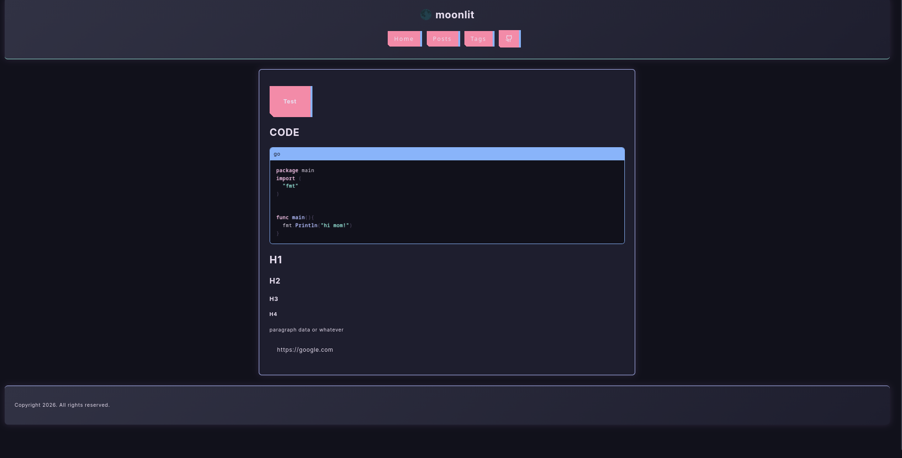
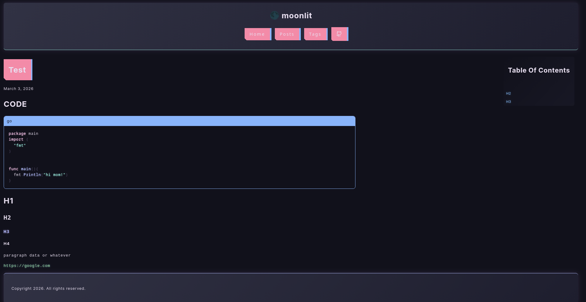

# Moonlit

custom hugo theme

cyberpunk and lofi with minimalism

```toml

baseURL = 'https://example.org/'
languageCode = 'en-US'
title = 'moonlit'

[menus]
[[menus.main]]
name = 'Home'
pageRef = '/'
weight = 10

[[menus.main]]
name = 'Posts'
pageRef = '/posts'
weight = 20

[[menus.main]]
name = 'Tags'
pageRef = '/tags'
weight = 30

[module]
[module.hugoVersion]
extended = false
min = '0.146.0'

[params]
github = "https://github.com/Ceald1"
linkedin = ''
email = ''
twitter = ''
hackthebox = ''

```

## Tips

* for cover images set "cover" in the top of the post and set it to the url like: `/posts/something/image.png`

## Screenshots



